# 🎵 Musify - Music Streaming App

A beautiful and feature-rich music streaming application built with Flutter, featuring a modern UI, offline support, and user-specific data management.

<div align="center">
  
  
  
  
</div>

## ✨ Features

### 🎧 Music Playback
- Stream high-quality audio
- Play, pause, skip, and seek controls
- Background audio playback
- Queue management
- Shuffle and repeat modes

### 👤 User Management
- User registration and login
- Profile customization with photo upload
- User-specific data isolation
- Secure authentication
- Profile editing

### 💾 Data Management
- **Favorites**: Save your favorite songs
- **Recently Played**: Track your listening history
- **Downloads**: Offline music support
- **Playlists**: Create and manage custom playlists
- **User-Specific Storage**: Each user has isolated data

### 🎨 UI/UX
- Modern Material Design 3
- Dark mode support
- Smooth animations
- Responsive design
- Beautiful gradients and cards

### 🔍 Discovery
- Trending songs
- Popular tracks
- New releases
- Search functionality
- Genre-based browsing

## 📱 Screenshots

<div align="center">
  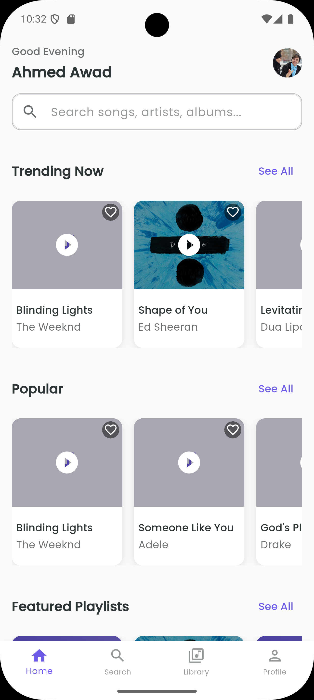
  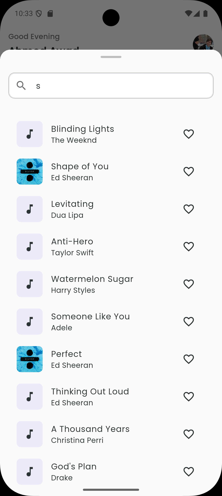
  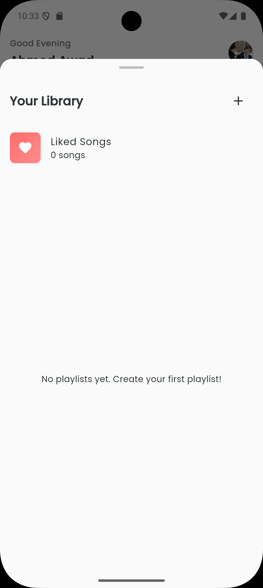
  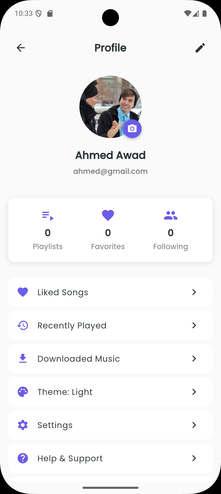
  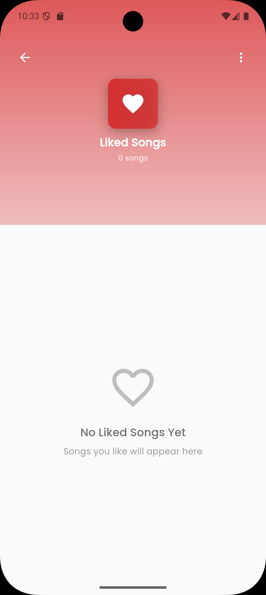
  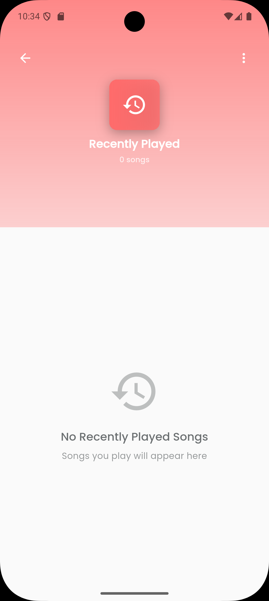
  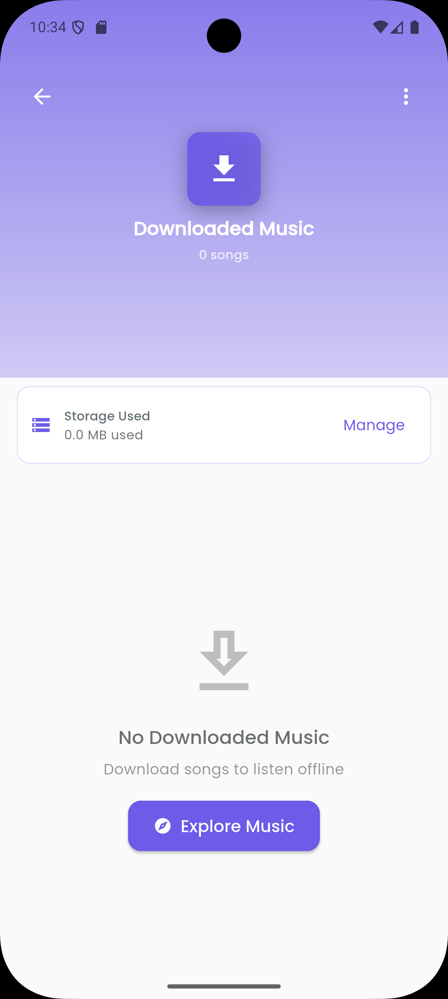
  
  
  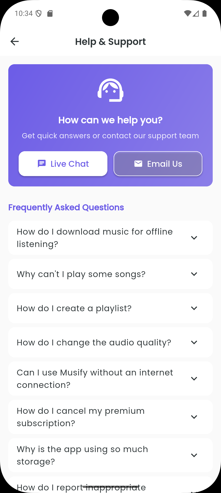
  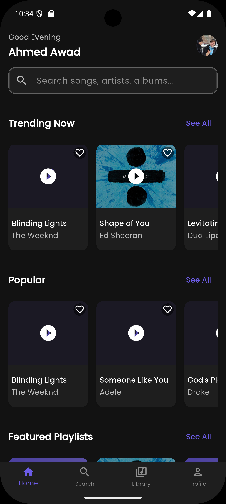
  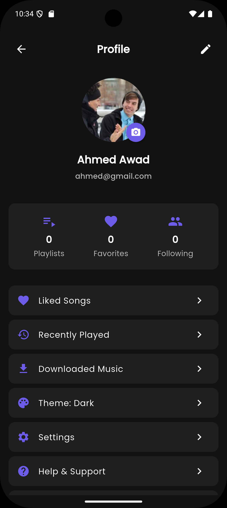
  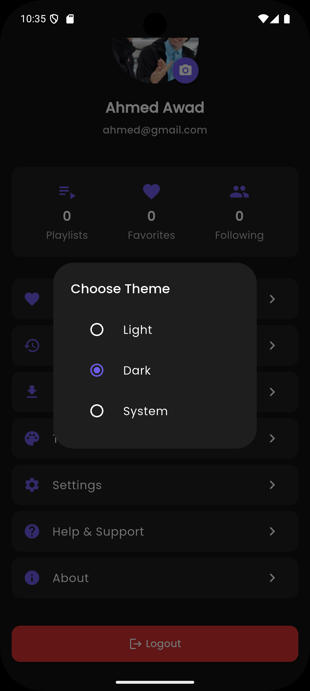
  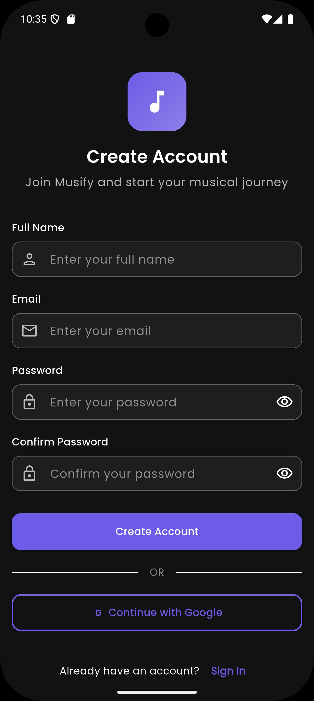
  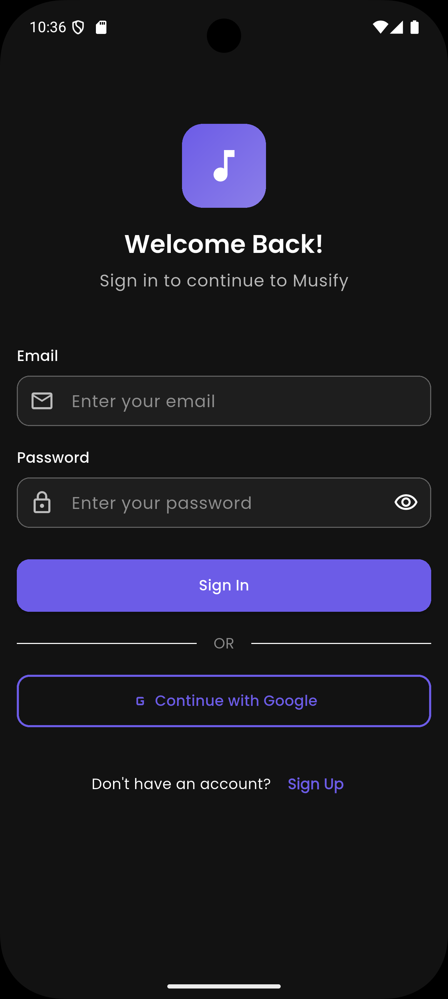
</div>
## 🏗️ Architecture

The app follows **Clean Architecture** principles with **MVVM** pattern:

```
lib/
├── core/
│   ├── adapters/         # Custom type adapters (Duration, etc.)
│   ├── config/           # App configuration
│   ├── constants/        # App constants
│   ├── models/           # Data models (User, Song, Playlist)
│   ├── providers/        # State management (Provider)
│   ├── routes/           # Navigation (GoRouter)
│   ├── services/         # Business logic services
│   └── theme/            # App theming
├── features/             # Feature modules
│   ├── auth/            # Authentication screens
│   ├── home/            # Home screen
│   ├── player/          # Music player
│   ├── playlist/        # Playlist management
│   ├── profile/         # User profile
│   └── splash/          # Splash screen
└── shared/              # Shared widgets and utilities
```

## 🚀 Getting Started

### Prerequisites

- Flutter SDK (3.0 or higher)
- Dart SDK (3.0 or higher)
- Android Studio / VS Code
- Android SDK / Xcode (for iOS)

### Installation

1. **Clone the repository**
```bash
git clone https://github.com/YOUR_USERNAME/musify.git
cd musify
```

2. **Install dependencies**
```bash
flutter pub get
```

3. **Run the app**
```bash
# For Android
flutter run

# For iOS
flutter run -d ios

# For Web
flutter run -d chrome
```

## 🔧 Configuration

### Local Storage Mode (Default)

The app works out of the box with local storage using Hive. No additional configuration needed!

### Firebase Mode (Optional)

To enable Firebase authentication and cloud storage:

1. Create a Firebase project at [Firebase Console](https://console.firebase.google.com/)

2. Add your Android/iOS apps to the Firebase project

3. Download configuration files:
   - `google-services.json` for Android → `android/app/`
   - `GoogleService-Info.plist` for iOS → `ios/Runner/`

4. Run FlutterFire CLI:
```bash
flutterfire configure
```

5. Enable Firebase in the app:
```dart
// lib/core/providers/auth_provider.dart
const bool USE_FIREBASE = true;  // Change to true
```

6. Enable Authentication methods in Firebase Console:
   - Email/Password
   - Google Sign-In (optional)

For detailed Firebase setup, see [FIREBASE_SETUP.md](FIREBASE_SETUP.md)

## 📦 Dependencies

### Core
- `flutter` - UI framework
- `provider` - State management
- `go_router` - Navigation

### Storage
- `hive` - Local database
- `hive_flutter` - Hive Flutter integration
- `shared_preferences` - Simple key-value storage

### Audio
- `just_audio` - Audio playback
- `audio_service` - Background audio

### Firebase (Optional)
- `firebase_core` - Firebase SDK
- `firebase_auth` - Authentication
- `cloud_firestore` - Cloud database

### UI/UX
- `cached_network_image` - Image caching
- `image_picker` - Photo selection
- `flutter_svg` - SVG support

### Utilities
- `intl` - Internationalization
- `path_provider` - File system paths
- `permission_handler` - Runtime permissions

## 🎯 Key Features Implementation

### User-Specific Data Storage

Each user has completely isolated data:

```dart
// Favorites stored with user ID
favorites_userId_123
favorites_userId_456

// Recently played stored with user ID
recently_played_userId_123_0
recently_played_userId_123_1
```

### Authentication Flow

1. **Registration**: User creates account → Saved to local storage → Redirected to login
2. **Login**: Credentials verified → User data loaded → Navigate to home
3. **Logout**: User data cleared from memory → Redirected to login

### Audio Playback

- Uses `just_audio` for reliable audio streaming
- Supports background playback with `audio_service`
- Queue management with skip/previous functionality
- Position tracking and seeking

## 🧪 Testing

Run tests:
```bash
flutter test
```

Run integration tests:
```bash
flutter test integration_test
```

## 📝 Documentation

- [Firebase Setup Guide](FIREBASE_SETUP.md) - Complete Firebase configuration
- [Quick Firebase Setup](QUICK_FIREBASE_SETUP.md) - Quick start guide
- [User Data Implementation](USER_DATA_IMPLEMENTATION.md) - Technical details
- [Testing Guide (Arabic)](دليل_الاختبار.md) - Testing instructions in Arabic

## 🤝 Contributing

Contributions are welcome! Please feel free to submit a Pull Request.

1. Fork the project
2. Create your feature branch (`git checkout -b feature/AmazingFeature`)
3. Commit your changes (`git commit -m 'Add some AmazingFeature'`)
4. Push to the branch (`git push origin feature/AmazingFeature`)
5. Open a Pull Request

## 📄 License

This project is licensed under the MIT License - see the [LICENSE](LICENSE) file for details.

## 👨‍💻 Author

**Your Name**
- GitHub: [@YOUR_USERNAME](https://github.com/YOUR_USERNAME)
- Email: your.email@example.com

## 🙏 Acknowledgments

- Flutter team for the amazing framework
- Audio samples from [Learning Container](https://www.learningcontainer.com/)
- Icons from [Material Design Icons](https://materialdesignicons.com/)
- Inspiration from Spotify and Apple Music

## 📞 Support

If you have any questions or need help, please:
- Open an issue on GitHub
- Contact via email
- Check the documentation files

## 🗺️ Roadmap

- [ ] Add social features (follow users, share playlists)
- [ ] Implement lyrics display
- [ ] Add equalizer
- [ ] Support for podcasts
- [ ] Cross-platform sync with Firebase
- [ ] Add music recommendations based on listening history
- [ ] Support for multiple languages
- [ ] Add sleep timer
- [ ] Implement car mode UI

---

<div align="center">
  Made with ❤️ using Flutter
</div>
